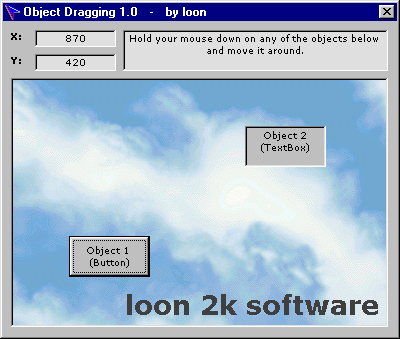



## Object Dragging 1\.0

### Description

This is a VERY simple way to drag objects around on a form. I know a few people have been looking for this so I uploaded an example I made, check out the screen shot.
 
### More Info
 

             |
---                |---
**Submitted On**   |2001-02-11 18:58:40
**By**             |[loon](https://github.com/Planet-Source-Code/PSCIndex/blob/master/ByAuthor/loon.md)
**Level**          |Beginner
**User Rating**    |5.0 (15 globes from 3 users)
**Compatibility**  |VB 6\.0
**Category**       |[Miscellaneous](https://github.com/Planet-Source-Code/PSCIndex/blob/master/ByCategory/miscellaneous__1-1.md)
**World**          |[Visual Basic](https://github.com/Planet-Source-Code/PSCIndex/blob/master/ByWorld/visual-basic.md)
**Archive File**   |[CODE\_UPLOAD148332112001\.zip](https://github.com/Planet-Source-Code/loon-object-dragging-1-0__1-15221/archive/master.zip)

